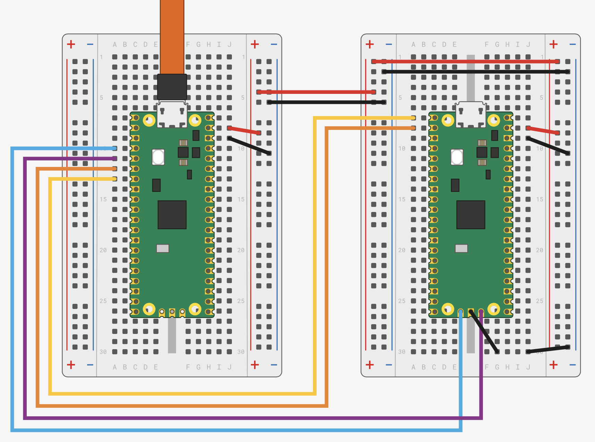
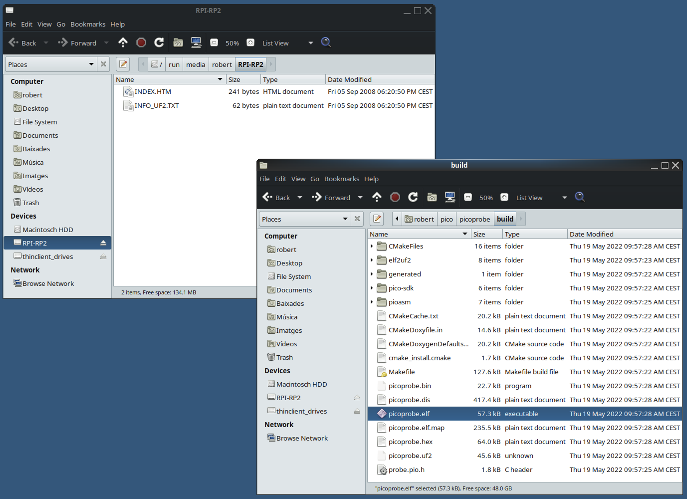

# Debugging Raspberry Pi Pico C/C++ apps using VS Code on Fedora

Further information is available at [DigiHey](https://www.digikey.be/en/maker/projects/raspberry-pi-pico-and-rp2040-cc-part-2-debugging-with-vs-code/470abc7efb07432b82c95f6f67f184c0).

## Install the Toolkits

- Extract [GNU Arm Embedded Toolchain](https://developer.arm.com/tools-and-software/open-source-software/developer-tools/gnu-toolchain/gnu-rm/downloads) on ~/pico folder:
```
$ mkdir -p ~/pico
$ cd ~/pico
$ tar xavf gcc-arm-none-eabi-10.3-2021.10-x86_64-linux.tar.bz2
$ rm -f gcc-arm-none-eabi-10.3-2021.10-x86_64-linux.tar.bz2
```

- Update PATH environment variable
```
$ cat ~/.bashrc
<cut>
PATH="/home/robert/pico/gcc-arm-none-eabi-10.3-2021.10/bin:$PATH"
export PATH
```

- Install Raspberry Pi Pico C/C++ Toolchain, vscode and vscode-plugins (cortex-debug, cmake-tools, cpptools)
```
$ source ~/.bashrc
$ ./pico_setup.sh
```

## Setup Picoprobe

One Raspberry Pi Pico can be used to reprogram and debug another, using the picoprobe firmware, which transforms a Pico into a USB → SWD and UART bridge. 

### wiring



```
Pico A GND -> Pico B GND
Pico A GP2 -> Pico B SWCLK
Pico A GP3 -> Pico B SWDIO
Pico A GP4/UART1 TX -> Pico B GP1/UART0 RX
Pico A GP5/UART1 RX -> Pico B GP0/UART0 TX
```

### upload picoprobe.uf2

Put your debugger Pico into bootloader mode by pressing and holding the BOOTSEL button while plugging in the USB cable. The Pico should enumerate as a drive on your computer named RPI-RP2. Next, copy picoprobe.uf2 to the RPI-RP2 drive.



```
$ sudo dmesg
<cut>
[12147.376148] usb 2-1.4: USB disconnect, device number 9
[12149.351421] usb 2-1.4: new full-speed USB device number 10 using ehci-pci
[12149.443289] usb 2-1.4: New USB device found, idVendor=2e8a, idProduct=0004, bcdDevice= 1.00
[12149.443296] usb 2-1.4: New USB device strings: Mfr=1, Product=2, SerialNumber=3
[12149.443300] usb 2-1.4: Product: Picoprobe
[12149.443303] usb 2-1.4: Manufacturer: Raspberry Pi
[12149.443305] usb 2-1.4: SerialNumber: E660C06213554C33
[12149.446592] cdc_acm 2-1.4:1.0: ttyACM0: USB ACM device
```

## Setup VS Code
### cmake tools extension settings
- Build Environment
  - Add PICO_SDK_PATH variable pointing to pico-sdk (e.g. /home/robert/pico/pico-sdk)
- Generator
  - Type “Unix Makefiles” (without the quotation marks)
