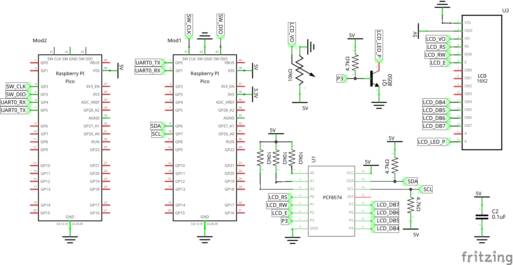
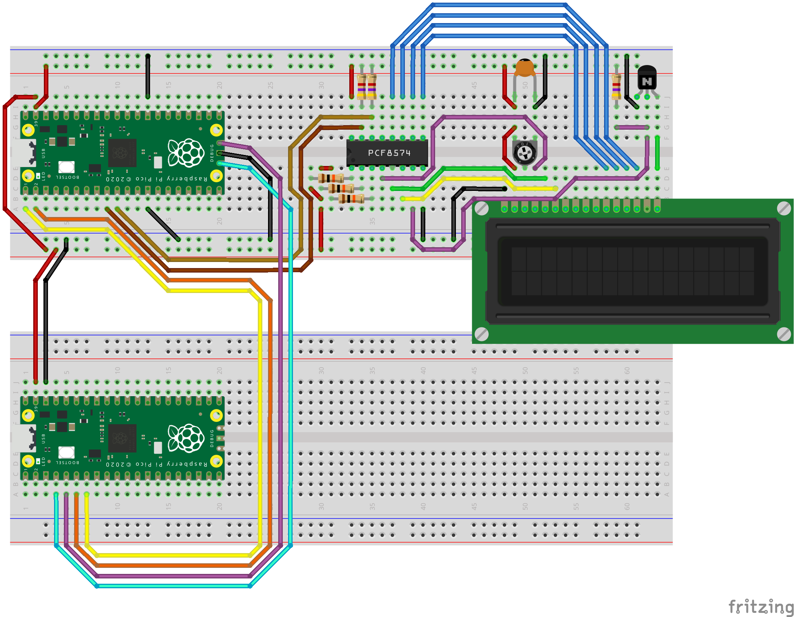

# Liquid-Crystal Display via a I2C bridge chip

Example code to drive a 16x2 LCD panel via a I2C bridge chip (e.g. PCF8574)

| Raspberry Pi Pico | Pin | I2C LCD Module | Pin |
|:-----------------:|----:|:--------------:|----:|
|               VSS |  39 | VSS            |  1  |
|               GND |  38 | GND            |  2  |
|          I2C1 SDA |   9 | SDA            |  3  |
|          I2C1 SCL |  10 | SCL            |  4  |

## Schema

## Board

## Project Settings

### select build kit

- Click on **No active kit** at the toolbar placed at the bottom of VS Code
- Click on **Scan for kits**
- Select your **GCC for arm-none-eabi** (e.g. /home/robert/pico/gcc-arm-none-eabi-10.3-2021.10)

### update project variables

- Remember to update the paths below on your system:

https://github.com/rbuj/raspberry-pi-pico-c-fedora/blob/main/i2c_lcd_1602/.vscode/launch.json#L20

https://github.com/rbuj/raspberry-pi-pico-c-fedora/blob/main/i2c_lcd_1602/.vscode/settings.json#L21

## Start Debugging

Press <kbd>F5</kbd>, or select Run -> Start Degugging from Code menubar.

Select the elf file if Code asks you which file do you you to debug.
