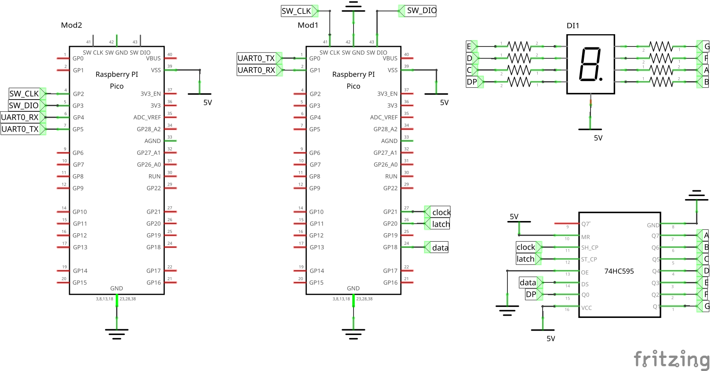
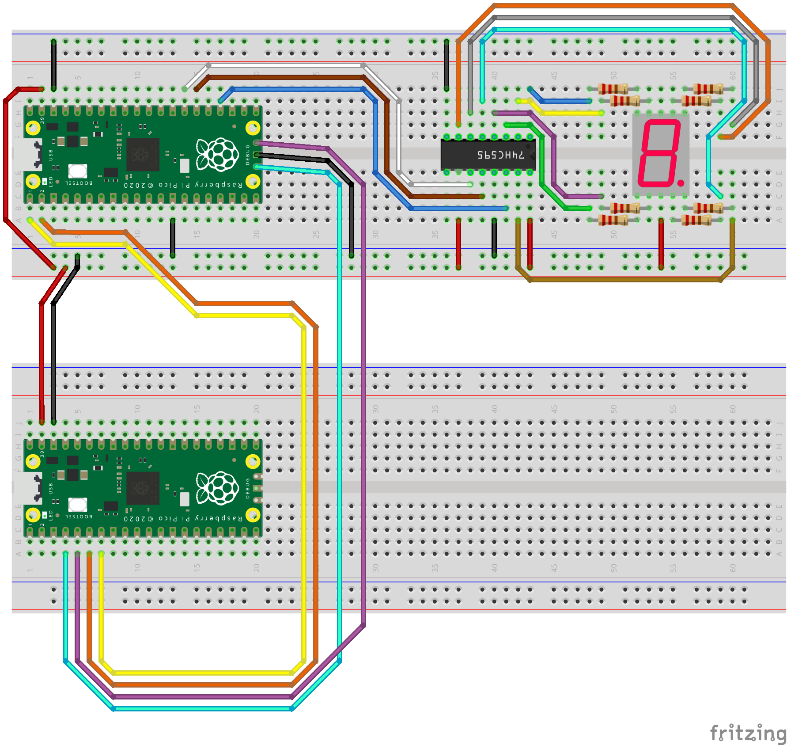

# Seven Segment Display

This example displays the numerical digits [0,9] in a 7-segment display within an infinite loop. The RP2040 microcontroller sends serially the numerical digit to display to the 7-segment display using an external 8-bit shift register (74HC595). Three pins of the RP2040 are used to send the numerical digit to the 8-bit shift register: GP18 (data), GP20 (latch), GP21 (clock). The parallel output (Q7, Q6, Q5, Q4, Q3, Q2, Q1, Q0) of the 8-bit shift register is connected to the 7-segment display (A, B, C, D, E, F, G, DP).

## Components

| Component                               |  Quantity |
|-----------------------------------------|----------:|
| Raspberry Pi Pico                       |         2 |
| 74HC595                                 |         1 |
| 5161BS (7-segment display common anode) |         1 |
| Resistor 220Ω                           |         8 |

## Schema


## Board



## Project Settings

### select build kit

- Click on **No active kit** at the toolbar placed at the bottom of VS Code
- Click on **Scan for kits**
- Select your **GCC for arm-none-eabi** (e.g. /home/robert/pico/gcc-arm-none-eabi-10.3-2021.10)

### update project variables
- Remember to update the paths below on your system:

https://github.com/rbuj/raspberry-pi-pico-c-fedora/blob/main/seven_segment_display/.vscode/launch.json#L20

https://github.com/rbuj/raspberry-pi-pico-c-fedora/blob/main/seven_segment_display/.vscode/settings.json#L21

## Start Debugging

Press <kbd>F5</kbd>, or select Run -> Start Degugging from Code menubar.

Select the elf file if Code asks you which file do you you to debug.

## Serial Port Output

Use dmesg to get the serial port of Raspberry Pi with Picoprobe:
```
$ dmesg
<cut>
[11581.741938] usb 2-1.4: new full-speed USB device number 6 using ehci-pci
[11581.833797] usb 2-1.4: New USB device found, idVendor=2e8a, idProduct=0004, bcdDevice= 1.00
[11581.833805] usb 2-1.4: New USB device strings: Mfr=1, Product=2, SerialNumber=3
[11581.833809] usb 2-1.4: Product: Picoprobe
[11581.833811] usb 2-1.4: Manufacturer: Raspberry Pi
[11581.833814] usb 2-1.4: SerialNumber: E660C06213554C33
[11581.834802] cdc_acm 2-1.4:1.0: ttyACM0: USB ACM device
<cut>
```
Connect to /dev/ttyACM0 at 115200 using minicom:
```
$ minicom -b 115200 -D /dev/ttyACM0
```
Note: hit <kbd>Enter</kbd>. then <kbd>Control</kbd>+<kbd>A</kbd> then <kbd>Q</kbd> then <kbd>Enter</kbd> to exit minicom.
